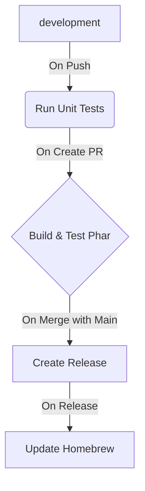

```mermaid
graph TD
    A[development] -->|On Push| B(Run Unit Tests)
    B --> |On Create PR| C{Build & Test Phar}
    C -->|On Merge with Main| D[Create Release]
    D -->|On Release| E[Update Homebrew]

```
